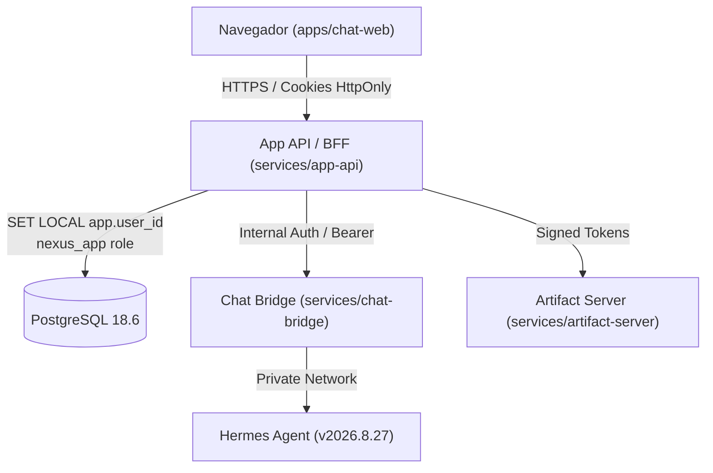

# Plano Arquitetural e de Implementação: Marco M4 (Auth e App API/BFF)

**Data:** 2026-09-11  
**Estado:** Pronto para Execução  
**Marco:** M4 (Auth e App API/BFF) — 18% do programa  
**Referência Arquitetural:** [ADR-0003](../decisions/ADR-0003-auth-sessions-and-app-api.md)

---

## 1. Visão Geral e Objetivos

O Marco M4 estabelece a fronteira definitiva da aplicação para o navegador. Atualmente, o frontend (`apps/chat-web`) possui mais de 36 arquivos acoplados diretamente ao Supabase (`@supabase/supabase-js`).

### Objetivos Principais:
1. **Eliminar o acesso direto do navegador ao banco e storage:** Todo o tráfego do frontend passará por uma App API / BFF própria.
2. **Substituir o Supabase Auth (GoTrue):** Criar serviço próprio de autenticação com cookies seguros `HttpOnly` e sessões rastreáveis.
3. **Garantir compatibilidade de senhas:** Aceitar os hashes de senha existentes em `auth.users` (bcrypt `$2a$` / `$2b$`) para que nenhum usuário precise redefinir credenciais.
4. **Substituir Edge Functions de administração:** Consolidar rotas protegidas para criação, reset e remoção de usuários.
5. **Hardening de RLS:** Passar as políticas de RLS em `chat` e `iam` de permissivas (`USING true`) para restrição estrita via `current_setting('app.user_id')`.

---

## 2. Desenho Arquitetural da App API / BFF



### 2.1 Modelo de Dados para Autenticação (`iam`)

A ser adicionado via migration `0005_auth_sessions.sql`:

```sql
-- Armazenamento seguro de credenciais
CREATE TABLE iam.user_credentials (
  user_id uuid PRIMARY KEY REFERENCES iam.principals(id) ON DELETE CASCADE,
  password_hash text NOT NULL,
  algorithm text NOT NULL DEFAULT 'bcrypt',
  failed_login_attempts integer NOT NULL DEFAULT 0,
  locked_until timestamptz,
  created_at timestamptz NOT NULL DEFAULT transaction_timestamp(),
  updated_at timestamptz NOT NULL DEFAULT transaction_timestamp()
);

-- Sessões ativas de usuário (Tokens opacos para cookie)
CREATE TABLE iam.user_sessions (
  id uuid PRIMARY KEY DEFAULT gen_random_uuid(),
  user_id uuid NOT NULL REFERENCES iam.principals(id) ON DELETE CASCADE,
  session_token_hash text NOT NULL UNIQUE,
  ip_address text,
  user_agent text,
  expires_at timestamptz NOT NULL,
  created_at timestamptz NOT NULL DEFAULT transaction_timestamp(),
  updated_at timestamptz NOT NULL DEFAULT transaction_timestamp()
);
CREATE INDEX idx_user_sessions_user_id ON iam.user_sessions(user_id);
CREATE INDEX idx_user_sessions_expires_at ON iam.user_sessions(expires_at);
```

### 2.2 Rotas da App API / BFF

#### Autenticação (`/api/auth`)
- `POST /api/auth/login`: Valida email + senha (bcrypt), cria registro em `iam.user_sessions`, define cookie `HttpOnly` com token de sessão.
- `POST /api/auth/logout`: Invalida o token em `iam.user_sessions` e limpa o cookie.
- `GET /api/auth/session`: Retorna os dados do usuário autenticado (`id`, `email`, `full_name`, `role`, `tenant_id`) se o cookie for válido.
- `POST /api/auth/change-password`: Atualiza a senha do usuário autenticado.

#### Administração de Usuários (`/api/admin/users`) — Substitui Edge Functions
- `POST /api/admin/users`: Cria principal + credentials + membership (substitui `admin-create-user`).
- `POST /api/admin/users/:id/reset-password`: Gera senha temporária ou token de redefinição (substitui `admin-reset-password`).
- `DELETE /api/admin/users/:id`: Desativa ou remove o usuário (substitui `admin-delete-user`).

#### Domínio de Chat (`/api/chat`)
- `GET /api/chat/sessions`: Lista sessões do usuário autenticado (`chat.chat_sessions`).
- `POST /api/chat/sessions`: Cria nova sessão.
- `GET /api/chat/sessions/:id`: Obtém sessão com histórico de mensagens.
- `DELETE /api/chat/sessions/:id`: Remove sessão (com cascata).
- `POST /api/chat/sessions/:id/messages`: Envia mensagem do usuário.
- `GET /api/chat/runs/:id`: Consulta status da execução do agente.

---

## 3. Divisão de Tarefas de Implementação

O lote M4 será executado nas seguintes tarefas incrementais:

### Tarefa 1: Migration `0005_auth_sessions.sql` e Hardening RLS
- Criar tabelas `iam.user_credentials` e `iam.user_sessions`.
- Anexar índices de FK e triggers de `updated_at`.
- Atualizar RLS de `chat` e `iam` para verificar `current_setting('app.user_id', true) = user_id::text`.
- Adicionar `FORCE ROW LEVEL SECURITY` em todas as tabelas de domínio.
- Validação com testes de contrato SQL e integração Docker.

### Tarefa 2: Serviço de Autenticação e Sessões (Backend)
- Implementar biblioteca/módulo de autenticação com suporte a validação de hash `bcrypt` compatível com Supabase.
- Handlers de login, logout e resolução de sessão via cookie `HttpOnly`.
- Middleware de injeção de contexto PostgreSQL (`SET LOCAL app.user_id`, `SET LOCAL app.tenant_id`).

### Tarefa 3: App API / BFF Core e Rotas de Chat
- Estruturação do servidor da App API (ou extensão do BFF `chat-bridge`).
- Implementação dos endpoints de CRUD de sessões, mensagens e integração com o Artifact Server para anexos.
- Proxy/Orquestração do Chat Bridge para execuções de Runs do Hermes.

### Tarefa 4: Refatoração do Frontend (`apps/chat-web`)
- Criação de cliente HTTP nativo tipado `src/lib/api.ts` substituindo `@supabase/supabase-js`.
- Atualização do `AuthContext.tsx` e `Login.tsx` para usar `/api/auth/*`.
- Atualização do `chatService.ts` para usar `/api/chat/*`.
- Remoção do pacote `@supabase/supabase-js` do `package.json` do frontend.

---

## 4. Plano de Verificação e Evidências

1. **Testes Unitários:**
   - Validação de hashes de senha (verificar se senha criada no Supabase GoTrue autentica com sucesso).
   - Teste de expiração e revogação de sessões.
2. **Testes de Integração Docker:**
   - Prova de isolamento RLS: Usuário A não consegue ver sessões ou mensagens do Usuário B.
   - Prova de limpeza de contexto de conexão após commit e rollback no pool `pg`.
3. **Testes End-to-End do Frontend:**
   - Fluxo completo: Login -> Criação de Sessão de Chat -> Envio de Mensagem -> Logout.
   - Verificação no Network tab de que nenhuma requisição sai para domínios externos do Supabase.

---

## 5. Estratégia de Rollback
- Todas as migrations possuem idempotência e versionamento contínuo (`0005`).
- Os componentes legados continuam acessíveis no branch anterior até que o gate de M4 e M6 (cutover de dados) seja homologado.
